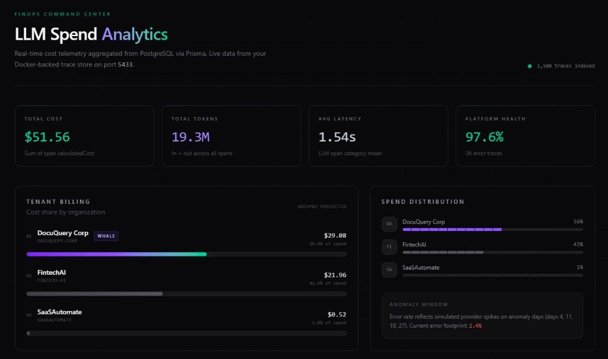

# LLMTokenLedger



Track LLM token spend from your backend. Wrap an LLM call, get tokens + cost logged automatically. View everything on a dashboard.

## Quick start

```bash
npm install
cp .env.example .env
docker compose up -d
npx prisma db push
npm run dev
```

Open [http://localhost:3000](http://localhost:3000) for the dashboard.

Optional demo data:

```bash
npm run db:seed
```

## Integrate into your backend

Wrap any LLM call with the SDK. It counts tokens, calculates cost, and saves a trace without slowing down your request.

```typescript
import { FlightRecorder } from "@/lib/flight-recorder-sdk";

const response = await FlightRecorder.trace(
  {
    featureName: "chat",
    modelName: "gpt-4o-mini",
    route: "/api/chat",
    input: prompt,
  },
  () => openai.chat.completions.create({
    model: "gpt-4o-mini",
    messages: [{ role: "user", content: prompt }],
  })
);
```

Works with OpenAI, Anthropic, and any provider that returns token usage in the response.

### Or send traces over HTTP

If your backend is a separate service, POST to the ingestion API:

```
POST /api/v1/traces
```

## What you get

**Token + cost tracking** per request (input/output tokens, USD)

**Dashboard** for total spend, latency, and recent traces

**Budget gate** as an optional CI check to block expensive prompt changes

```bash
npm run budget:check
```

## Stack

Next.js · PostgreSQL · Prisma · TypeScript
